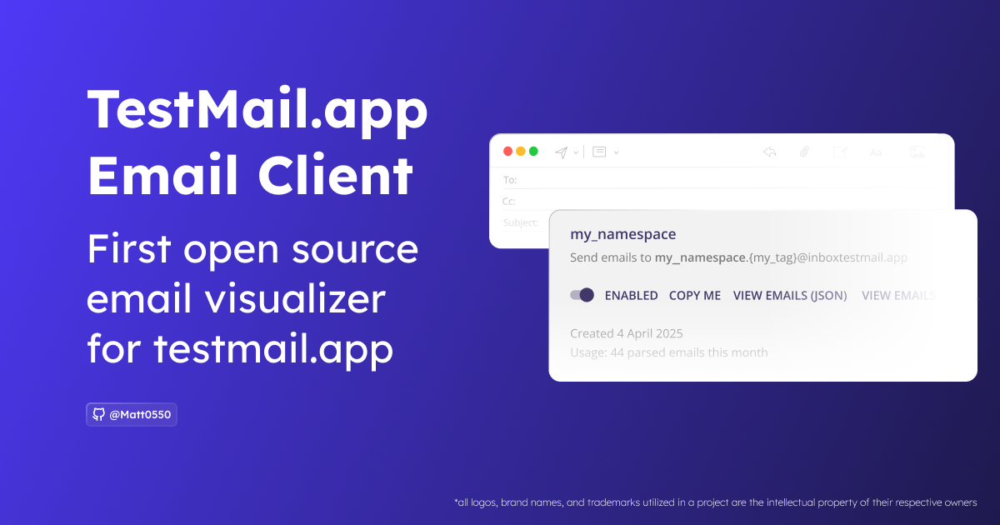

<!-- PROJECT LOGO -->
<a href="https://github.com/Matt0550/testmail.app-vue-client">
  
</a>
<br />
<div align="center">
  <!-- <a href="https://github.com/Matt0550/testmail.app-vue-client">
    
  </a> -->

  <h3 align="center">TestMail.app Email Viewer</h3>

  <p align="center">
    A lightweight client for inspecting and debugging emails from Testmail.app service. Offline-capable PWA with local storage for email headers and content.
    <br />
    <br />
    <a href="https://matt05.it/testmailapp">Try It Now</a>
    ·
    <a href="https://github.com/Matt0550/testmail.app-vue-client/issues">Report Bug</a>
    ·
    <a href="https://github.com/Matt0550/testmail.app-vue-client/issues">Request Feature</a>
  </p>

  [![Forks][forks-shield]][forks-url]
  [![Stargazers][stars-shield]][stars-url]
  [![Issues][issues-shield]][issues-url]
  [![MIT License][license-shield]][license-url]
  [![Discord][discord-shield]][discord-url]
</div>


# TestMail.app Email Viewer

A lightweight Vue 3 client for inspecting and debugging test emails from Testmail.app service. The app is an offline-capable PWA that stores email headers and content locally (IndexedDB), supports search & filters, attachment previews, and deep-linking.

## Demo
- Try the public demo: https://matt05.it/testmailapp

## Quick usage

1. Open **Settings** and enter your API key and Namespace (from testmail.app).
2. After saving the settings the Inbox will load recent messages.
3. Click any message to view details. Attachments can be previewed or downloaded; EML download is available.
4. Use the search bar and API filters (tag, timestamp) to narrow results.

## Why this project

TestMail.app's built-in email preview is part of their **Pro** feature set - this repository provides an open, offline-capable alternative so developers and QA teams can inspect, store and share test emails locally without requiring a paid account.

## Features

- Vue 3 + Vite + TypeScript, TailwindCSS, PrimeVue
- PWA with Service Worker for offline access and caching
- Local persistence via IndexedDB (emails & attachments)
- Server-side + local search, tag/timestamp filters, paging
- Attachments and EML download
- Responsive design with mobile sidebar navigation

## TO-DO
- [ ] Add end-to-end tests (Cypress)
- [ ] Export / import stored emails (JSON)
- [ ] Improve email viewer layout and styling
- [ ] Accessibility and contrast improvements
- [ ] Add dark theme and user preferences

## Local development & installation

### Prerequisites
- Node 20+ (see `package.json` engines)
- npm (or yarn/pnpm)

### Install
```bash
git clone https://github.com/Matt0550/testmail.app-vue-client.git
cd testmail.app-vue-client
npm install
```

### Run (development)
```bash
npm run dev
# open http://localhost:5173
```

### Build & preview (production)
```bash
npm run build
npm run preview
```

### Type checking
```bash
npm run type-check
```

### Deploy
The app is a static SPA — deploy the `dist/` folder to Netlify, Vercel, GitHub Pages or any static host. For full PWA features (service worker) serve over HTTPS.

### Configuration
Configure the API key and Namespace from the in‑app **Settings** pane. The client stores settings locally; no server-side environment variables are required for the front-end.

### Troubleshooting
- If you see stale UI/assets after a build, unregister the service worker in DevTools → Application → Service Workers or use a private window.
- The app persists emails in IndexedDB — clearing the browser storage will remove saved emails.


## Help - feedback
You can contact me on:

Discord: https://matt05.it/discord

Telegram: https://matt05.it/telegram

Mail: <a href="mailto:mail@matteosillitti.com">mail@matteosillitti.com</a>


# License

[MIT](https://choosealicense.com/licenses/mit/)

# Support me

[](https://ko-fi.com/matt05)

[](https://www.buymeacoffee.com/Matt0550)

[](https://paypal.me/sillittimatteo)

[contributors-shield]: https://img.shields.io/github/contributors/Matt0550/testmail.app-vue-client.svg
[contributors-url]: https://github.com/Matt0550/testmail.app-vue-client/graphs/contributors
[forks-shield]: https://img.shields.io/github/forks/Matt0550/testmail.app-vue-client.svg
[forks-url]: https://github.com/Matt0550/testmail.app-vue-client/network/members
[stars-shield]: https://img.shields.io/github/stars/Matt0550/testmail.app-vue-client.svg?
[stars-url]: https://github.com/Matt0550/testmail.app-vue-client/stargazers
[issues-shield]: https://img.shields.io/github/issues/Matt0550/testmail.app-vue-client.svg
[issues-url]: https://github.com/Matt0550/testmail.app-vue-client/issues
[license-shield]: https://img.shields.io/github/license/Matt0550/testmail.app-vue-client.svg
[license-url]: https://github.com/Matt0550/testmail.app-vue-client/blob/main/LICENSE
[discord-shield]: https://img.shields.io/discord/828990499507404820
[discord-url]: https://discord.gg/MKvtQvUwNz